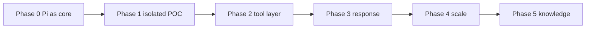
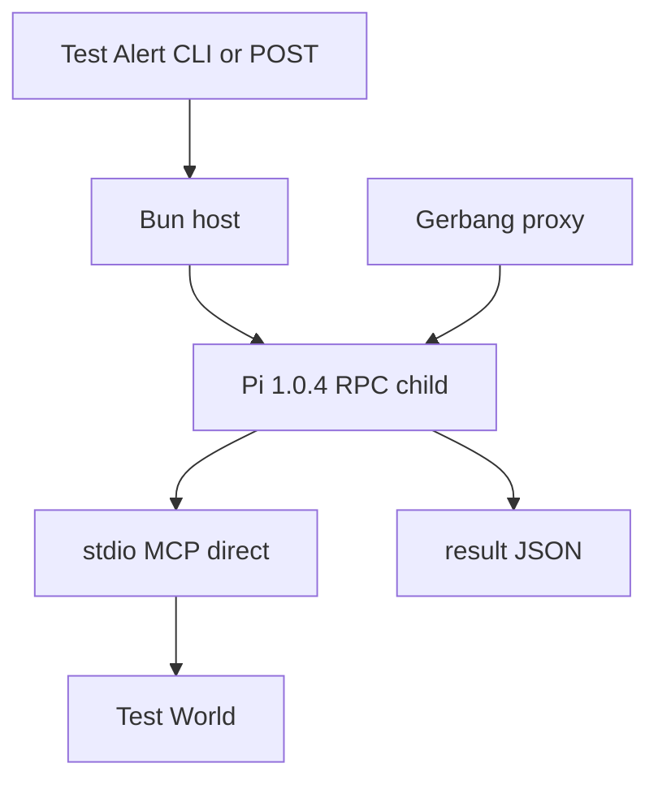
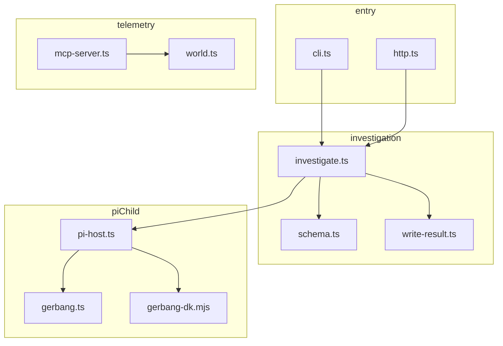
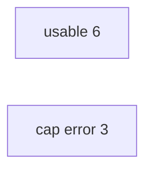
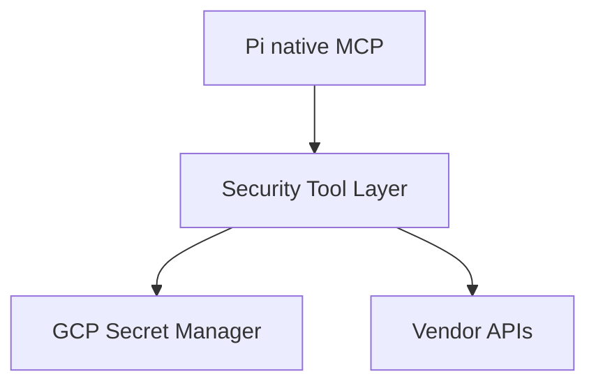

# Visuals

Committed diagrams for GitLab / GitHub / Cursor preview. Local HTML: open [`visuals/index.html`](visuals/index.html).

- [Roadmap](#roadmap)
- [Phase 1 runtime](#phase-1-runtime)
- [Codebase](#codebase)
- [POC score](#poc-score)
- [Phase 2 tool layer](#phase-2-tool-layer)

Source numbers: [`phase-1-scoring.md`](phase-1-scoring.md), [`phase-1-result.md`](phase-1-result.md). Architecture intent: [`pre-brainstorm.md`](../pre-brainstorm.md).

## Roadmap

Eval (accuracy, cost, analyst agreement) is **deferred**, not a numbered phase. Run it after real vendor queries exist.

Phase 1 is a **thin GO**. That does not authorize production SIEM.

## Phase 1 runtime

Frozen model: `dk/openrouter/deepseek/deepseek-v4.1-flash`. Caps: 10 min or 15 tool calls.

MCP here is **Pi native** (`.pi/mcp.json`). Not MCP Gateway.

## Codebase

Host is Bun. Pi child is Node. `RpcClient` always `spawn(node, [PI_CLI, ...])`.

## POC score

GO bar: ≥6/9 usable, ≥6/9 agentic, zero invented Evidence.

| id | usable | agentic | invented | actual |
|---|---|---|---|---|
| 01 | no | no | no | cap; alice TP path unfinished |
| 02 | yes | yes | no | FP office VPN |
| 03 | yes | yes | no | TP auth then process |
| 04 | no | no | no | cap |
| 05 | no | no | no | cap; wandered |
| 06 | yes | yes | no | TP process then auth |
| 07 | yes | yes | no | BTP scanner |
| 08 | yes | yes | no | BTP scanner |
| 09 | yes | yes | no | empty nobody; labeled FP |

## Phase 2 tool layer

MCP Gateway deferred. Secrets stay in the layer, not in Pi sessions. Narrow tools, not `arbitrary_http_request`.
